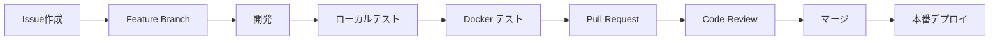

# 🚀 開発・運用戦略ガイド

このドキュメントは、ショート動画コンバータープロジェクトの長期的な開発・運用戦略を定義します。

## 📋 目次

1. [開発フロー](#開発フロー)
2. [Git戦略](#git戦略)
3. [Docker活用](#docker活用)
4. [継続的改良計画](#継続的改良計画)
5. [運用・監視](#運用監視)
6. [将来の機能拡張](#将来の機能拡張)

## 🔄 開発フロー

### 基本的な開発サイクル



### 開発環境の選択

| 用途 | 推奨環境 | コマンド |
|------|----------|----------|
| **新機能開発** | Docker Dev | `docker-compose -f docker-compose.dev.yml up -d` |
| **バグ修正** | ローカル環境 | `streamlit run app.py` |
| **テスト実行** | Docker本番環境 | `docker-compose up -d` |
| **デバッグ** | ローカル環境 | `python app.py` |

## 🌿 Git戦略

### ブランチ戦略（Git Flow簡略版）

```
main (本番)
├── develop (開発統合)
├── feature/short-video-filters (新機能)
├── feature/batch-processing (新機能)
├── hotfix/voicevox-timeout (緊急修正)
└── release/v2.0.0 (リリース準備)
```

### ブランチ命名規則

```bash
# 新機能
feature/video-batch-processing
feature/ai-auto-crop
feature/subtitle-generation

# バグ修正
bugfix/voicevox-connection-error
bugfix/memory-leak-issue

# 緊急修正
hotfix/security-vulnerability
hotfix/critical-crash

# リリース
release/v1.1.0
release/v2.0.0
```

### コミットメッセージ規則

```bash
# フォーマット: <type>(<scope>): <description>

feat(video): add batch processing for multiple videos
fix(voicevox): resolve connection timeout issue
docs(readme): update installation instructions
style(ui): improve button layout in main interface
refactor(audio): optimize BGM processing algorithm
test(video): add unit tests for resize function
chore(docker): update base image to python 3.11
```

### 開発ワークフロー

```bash
# 1. 最新のmainを取得
git checkout main
git pull origin main

# 2. 新しいfeatureブランチを作成
git checkout -b feature/video-auto-crop

# 3. 開発とコミット
git add .
git commit -m "feat(video): implement auto-crop functionality"

# 4. プッシュとPR作成
git push origin feature/video-auto-crop
# GitHubでPull Request作成

# 5. マージ後のクリーンアップ
git checkout main
git pull origin main
git branch -d feature/video-auto-crop
```

## 🐳 Docker活用戦略

### 開発ステージ別Docker使用法

#### 1. 開発段階
```bash
# ホットリロード付き開発環境
docker-compose -f docker-compose.dev.yml up -d

# ログ監視
docker-compose -f docker-compose.dev.yml logs -f app

# コンテナ内でのデバッグ
docker-compose -f docker-compose.dev.yml exec app bash
```

#### 2. テスト段階
```bash
# 本番環境と同じ構成でテスト
docker-compose up -d

# パフォーマンステスト
docker stats

# ヘルスチェック確認
docker-compose ps
```

#### 3. 本番環境
```bash
# 本番デプロイ
docker-compose -f docker-compose.prod.yml up -d

# 監視とログ
docker-compose logs --tail=100 -f
```

### イメージ管理戦略

```bash
# イメージビルドとタグ付け
docker build -t movie-converter:v1.0.0 .
docker build -t movie-converter:latest .

# 本番用マルチアーキテクチャビルド
docker buildx build --platform linux/amd64,linux/arm64 -t movie-converter:v1.0.0 .

# イメージのレジストリプッシュ
docker tag movie-converter:v1.0.0 your-registry/movie-converter:v1.0.0
docker push your-registry/movie-converter:v1.0.0
```

## 🔄 継続的改良計画

### Phase 1: 基盤強化（1-2ヶ月）

- [ ] **テスト自動化**
  - [ ] 単体テスト（pytest）
  - [ ] 統合テスト（Docker環境）
  - [ ] E2Eテスト（Selenium）

- [ ] **CI/CD パイプライン**
  - [ ] GitHub Actions設定
  - [ ] 自動ビルド・テスト
  - [ ] 自動デプロイ

- [ ] **監視・ログ**
  - [ ] アプリケーション監視
  - [ ] エラー追跡（Sentry）
  - [ ] パフォーマンス監視

### Phase 2: 機能拡張（2-4ヶ月）

- [ ] **AI機能**
  - [ ] 自動クロップ（顔検出）
  - [ ] 自動字幕生成
  - [ ] 音声認識

- [ ] **バッチ処理**
  - [ ] 複数動画の一括処理
  - [ ] 処理キュー管理
  - [ ] バックグラウンド処理

- [ ] **高度な編集機能**
  - [ ] フィルター・エフェクト
  - [ ] 音声調整
  - [ ] 動画安定化

### Phase 3: スケール対応（4-6ヶ月）

- [ ] **アーキテクチャ改善**
  - [ ] マイクロサービス化
  - [ ] Redis キューイング
  - [ ] CDN統合

- [ ] **SaaS化**
  - [ ] ユーザー管理
  - [ ] 課金システム
  - [ ] API提供

## 📊 運用・監視

### ログ戦略

```bash
# ログレベル設定
export LOG_LEVEL=INFO

# ログローテーション設定
# /etc/logrotate.d/movie-converter
/app/logs/*.log {
    daily
    rotate 30
    compress
    missingok
    notifempty
    create 0644 appuser appuser
}
```

### 監視メトリクス

| メトリクス | 目標値 | アラート閾値 |
|------------|--------|--------------|
| **レスポンス時間** | < 3秒 | > 10秒 |
| **エラー率** | < 1% | > 5% |
| **CPU使用率** | < 70% | > 90% |
| **メモリ使用率** | < 80% | > 95% |
| **ディスク使用率** | < 85% | > 95% |

### バックアップ戦略

```bash
# 毎日のデータバックアップ
#!/bin/bash
DATE=$(date +%Y%m%d)
docker run --rm -v movie_data:/data -v /backup:/backup alpine tar czf /backup/movie-data-$DATE.tar.gz /data

# 週次のシステムバックアップ
docker save movie-converter:latest | gzip > movie-converter-$DATE.tar.gz
```

## 🚀 将来の機能拡張

### 短期目標（1-3ヶ月）

1. **ユーザビリティ改善**
   - ドラッグ&ドロップファイルアップロード
   - プレビュー機能の強化
   - プログレスバーの詳細化

2. **動画処理の高速化**
   - GPU処理対応
   - 並列処理の最適化
   - キャッシュ機能

3. **新しい音声機能**
   - 複数話者対応
   - 感情表現の調整
   - 音声品質向上

### 中期目標（3-6ヶ月）

1. **AI機能の統合**
   - 自動クロップ（顔・被写体検出）
   - シーン自動分割
   - 音声自動調整

2. **クラウド対応**
   - AWS/GCP対応
   - 分散処理
   - CDN配信

3. **API化**
   - REST API提供
   - Webhook対応
   - 外部連携

### 長期目標（6ヶ月以上）

1. **SaaS化**
   - ユーザー管理
   - 課金システム
   - ダッシュボード

2. **エンタープライズ機能**
   - チーム管理
   - ブランド設定
   - 権限管理

3. **モバイル対応**
   - PWA化
   - モバイルアプリ
   - オフライン機能

## 📈 成功指標（KPI）

### 技術指標

- **可用性**: 99.9%以上
- **レスポンス時間**: 平均3秒以下
- **エラー率**: 1%以下
- **デプロイ頻度**: 週1回以上

### ユーザー指標

- **変換成功率**: 95%以上
- **ユーザー満足度**: 4.5/5以上
- **機能利用率**: 主要機能80%以上

### 開発効率指標

- **Issue解決時間**: 平均3日以内
- **コードレビュー時間**: 24時間以内
- **テストカバレッジ**: 80%以上

## 🔒 セキュリティ・コンプライアンス

### セキュリティ対策

- [ ] **依存関係の脆弱性チェック**
  - Dependabot有効化
  - セキュリティスキャン自動化

- [ ] **コンテナセキュリティ**
  - 非rootユーザー使用
  - 最小権限の原則
  - 定期的なイメージ更新

- [ ] **データ保護**
  - アップロードファイルの自動削除
  - ログのサニタイズ
  - 暗号化通信（HTTPS）

### コンプライアンス

- プライバシーポリシーの整備
- 利用規約の作成
- データ保持ポリシーの策定

## 🤝 チーム協力

### コードレビューガイドライン

1. **レビューポイント**
   - セキュリティ
   - パフォーマンス
   - 可読性
   - テストカバレッジ

2. **レビュー期限**
   - 24時間以内の初回レビュー
   - 48時間以内の承認

### ドキュメント管理

- [ ] **技術仕様書**の維持
- [ ] **API仕様書**の自動生成
- [ ] **運用マニュアル**の更新

## 📞 サポート・メンテナンス

### 定期メンテナンス

- **月次**: 依存関係の更新
- **四半期**: セキュリティ監査
- **半年**: アーキテクチャレビュー

### インシデント対応

1. **緊急度レベル**
   - P0: サービス停止（1時間以内対応）
   - P1: 重要機能障害（4時間以内対応）
   - P2: 軽微な不具合（1営業日以内対応）

2. **エスカレーション**
   - 開発者 → チームリード → プロダクトオーナー

---

このドキュメントは定期的に見直し、プロジェクトの成長に合わせて更新していきます。